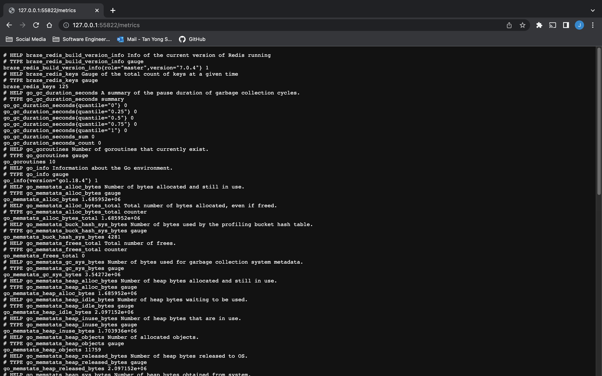

# Braze Technical Assessment

This is a Prometheus exporter for Redis and is my solution to the Braze Technical Assessment (see [brief](brief/README.md)).

## Installation

The exporter is written in Go and you will thus need the Go toolchain installed in order to build the binary. The given Makefile contains some useful commands for building and testing the code.

To install dependencies:

```
make deps
```

To build the `redis-exporter` binary into a local bin directory:

```
make bin/redis-exporter
```

To run tests:
```
make test
```

To build the Docker image:
```
make docker
```

## Usage

After completing the [getting started setup](brief/README.md#getting-started), to run the exporter in the `minikube` cluster:

1. Build the Docker image:

```
make docker
```

1. Load the image into `minikube`:

```
minikube image load jace-ys/redis-exporter:v0.0.0
```

2. Deploy the `redis-exporter` Deployment and Service into the cluster

```
kubectl apply -f kubernetes/redis-exporter
```

2. Get the Kubernetes URL(s) for the `redis-exporter` Service:

```
minikube service redis-exporter
```

3. Your browser should open up with the above URL. To view metrics from the exporter, append the `/metrics` path to the URL. Voilà!

## Evidence

Evidence of the `redis-exporter` successfully collecting metrics from the `redis-master` StatefulSet in the `minikube` cluster:



## Design Choices

### Code

The exporter is written as a Go HTTP service, exposing Prometheus metrics on the `/metrics` endpoints. It uses a Redis client to make downstream calls to fetch info and keys, then exporting metrics around them.

One explicit design decision that was made is to handle errors gracefully in the [`Collect`](main.go#L83) function; whenever we make a downstream call to Redis which results in an error, rather than failing hard and causing us to not export any metrics at all, I chose to just log the error and carry on to the next metric. This makes the exporter more tolerant to downstream failures and at least return some partial results.

Ideally, we should also be exporting metrics around the downstream collection process itself to give us visibility on the rate of downstream errors, but I have chosen to leave this out for now due to lack of time.

I have also chosen to make the exporter as unopinionated as possible, allowing one to set it up depending on their own use case. For example, the exporter doesn't dictate what metric namespace to use or whether username and password authentication with Redis is required. This is supported through the use of [config flags and environment variables](main.go#L24-26):

- `namespace`: Namespace prefix for exported metrics
- `redis.url`: Connection URL of the Redis server to collect metrics from

For our scenario, we [configure these parameters](kubernetes/redis-exporter/deployment.yaml#L34-37) in our Kubernetes Deployment.

### Deployment

I have chosen to deloy the exporter as a Kubernetes Deployment as it is stateless. Another option would be to deploy it as a container within the Redis StatefulSets themselves, which would allow the exporter to communicate with Redis over localhost instead of over the cluster network.

Within the Deployment, we run 3 replicas of the exporter to give us high availability. To get the password to authenticate with Redis, [we mount the `redis` Secret](kubernetes/redis-exporter/deployment.yaml#L32) (from the `bitnami/redis` Helm chart) into the `exporter` container's environment. This password is then used in the interpolation of the `REDIS_URL` that the exporter will use to connect with the downstream Redis instance. By mounting the secret, we don't have to manually read the secret out and hardcode it into the `REDIS_URL` itself, making the whole deployment setup more portable and work right out of the box.

## Future Improvements
- [ ] Add some basic test coverage
- [ ] Export metrics about the downstream collection process itself
- [ ] Use interfaces to allow us to dependency inject a Redis client into the exporter, allowing us to easily switch the underlying implementation